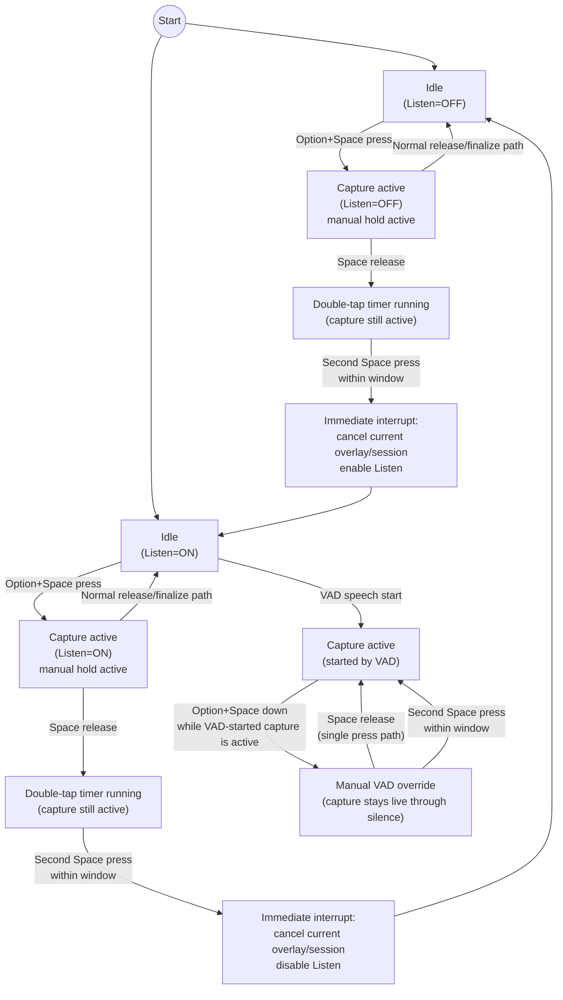

# Keyboard Shortcut State Machine

This document defines the current interaction state machine in `azad` for
hotkeys, listen mode, and overlay behavior (including split overlay lanes).

It is the source of truth for expected behavior and regression testing.

## Boundary

- `asr` does not know hotkeys, overlay UI, or listen-mode toggles.
- `azad` translates keyboard and menu events into:
  - state-machine inputs (`src/interaction_sm.rs`)
  - runtime actions against `SpeechSession` and platform overlay APIs.

## Runtime Inputs

- `Option+Space` press/release (hold-to-talk and double-tap detector)
- `Option+Space+Space` within tap window (listen mode toggle gesture)
- `Enter` and `Numpad Enter` (finalize)
- `Esc` (cancel current overlay turn)
- Menu toggle for listen mode
- Speech runtime events (`DraftUpdated`, `Finalizing`, `FinalText`, `Status`, etc.)

## Core Runtime Flags

- `always_listening_enabled`: global listen mode on/off.
- `manual_hold_active`: hold hotkey currently down.
- `hold_saw_speech`: current hold produced non-empty draft text.
- `overlay_visible`: main overlay visibility.
- `current_turn_id`: most recent live turn id.
- `finalizing_turn_id`: turn id currently finalizing.
- `latest_draft`: live lane text.
- `finalizing_draft`: finalizing lane text.
- `saw_vad_start_during_finalizing`: hint that a new lane started while top lane finalizes.

## Interaction Reducer

`src/interaction_sm.rs` is a pure reducer:

- Input type: `InteractionInput`
- State type: `InteractionState`
- Output type: `InteractionEffect`

The reducer has no platform calls. It only emits effects for `app.rs` to apply.

## High-Level Mode Flow



## Hold Origin Semantics

- `Option+Space` press must respond regardless of listen mode (`always_listening_enabled` on or off).
- Turn end behavior is based on how the active turn started:
  - Started by hold hotkey:
    - releasing hold ends/finalizes that turn.
  - Started by auto listen (VAD):
    - pressing hold enables manual VAD override (capture stays live through silence);
    - releasing hold does not force end.
  - Double-tap listen toggle gesture:
    - only valid before transcription has started for the current turn;
    - cancels in-flight overlay/session content;
    - does not finalize or paste the canceled text.

## Double-Tap Interpretation

- Double-tap timing is measured from the first `Option+Space` press timestamp.
- While that window is open, capture remains active.
- If the second Space press happens inside the window:
  - before transcription starts: immediately cancel the current overlay/session, then toggle Listen ON/OFF;
  - after transcription starts: do not toggle; continue normal capture path.
- If the window expires first:
  - no-op for toggle logic: no transition and no side effects.

## Overlay Lane Flow

```mermaid
flowchart LR
    A["Single Lane
(finalizing_turn_id absent)"] -->|Finalizing(turn N)| B["Top Lane Active
finalizing_turn_id=N"]
    B -->|DraftUpdated(turn N+1)| C["Split Lane Visible
Top=finalizing_draft
Bottom=latest_draft"]
    C -->|FinalText(turn N)| D["Top Lane Paste + Keep Bottom Live"]
    D -->|Bottom continues| E["Bottom Lane Finalizes Later"]
    B -->|No next lane speech| F["Single Finalizing Lane"]
    F -->|FinalText(turn N)| A
```

## Rule Table

| Case | Start | Event | Expected behavior |
|---|---|---|---|
| 1 | Listen off, idle | `HoldPressed` | Manual hold starts, capture on, overlay shown. |
| 2 | Listen off, manual hold | `HoldReleased` | If turn started, finalize/paste; else close overlay. |
| 3 | Listen off, idle | Double tap (`Option+Space+Space`) | Enable listen mode without starting hold. |
| 4 | Listen on, idle | Double tap | Disable listen mode without starting hold. |
| 5 | Listen on, idle | `HoldPressed` then `HoldReleased` | Behaves like manual hold session: release finalizes/pastes. |
| 6 | Listen on, active VAD turn | `HoldPressed` then `HoldReleased` | Hold is assist only; release returns to VAD flow, no forced finalize. |
| 7 | Listen on, active VAD turn (transcription already started) | Double tap second press | No listen toggle; continue active VAD-started capture flow. |
| 8 | Capture active, no transcription started yet | Double tap second press within window | Toggle listen and cancel in-flight overlay/session text (no finalize/paste). |
| 9 | Listen off, rapid release/re-press | First release then second hold | First turn can still paste while second turn is live. |
| 10 | Any visible actionable overlay | `Enter`/`Numpad Enter` | Finalize current actionable turn. |
| 11 | Any visible overlay | `Esc` | Cancel current turn and close overlay/lane as applicable. |
| 12 | Top lane finalizing, new speech starts | `DraftUpdated` for newer turn | Show split overlay once new lane has text. |

## Invariants

- A pure listen-mode toggle gesture from idle must not leave an empty stuck overlay.
- Releasing hold with no session must still clean up overlay state.
- Stale turn context without `has_started_turn` must not block listen-enable double tap.
- Split overlay only shows second lane when live lane has non-empty text.
- Finalizing completion for the top lane must not hide an active bottom lane.

## Test Coverage Mapping

- Reducer sequence coverage lives in `src/interaction_sm.rs` unit tests.
- Overlay lane logic coverage lives in `src/app.rs` unit tests (`split_overlay_*` and
  completion helpers).
- Runtime adapter coverage asserts effect application paths in `src/app.rs`.

## Transition Intent (Behavior-Level)

This section describes why each transition exists and what user-facing goal it preserves.

| Transition group | Intent |
|---|---|
| Idle -> manual hold capture (`Option+Space`) | User can always force speech capture instantly, regardless of listen mode. |
| Manual hold release (listen off) | End the active hold-started turn predictably: if speech exists, finalize/paste; if not, close quietly. |
| Manual hold press/release during VAD-started turn (listen on) | Hold acts as a temporary silence override and must not force-end the VAD turn on release. |
| Double tap (`Option+Space+Space`) | Global listen toggle gesture; cancels current in-flight capture instead of finalizing stale/partial text. |
| Double tap timing window expiry | Expiry is a no-op for mode toggle; capture continues naturally with no surprise side effects. |
| Enter/Numpad Enter finalize | Deterministic "finish now" behavior for currently actionable overlay content. |
| Esc cancel | Deterministic "discard current turn" behavior without hidden paste/finalize effects. |
| Single lane -> split lanes while previous turn finalizes | Preserve continuity when user keeps speaking: earlier turn finalizes/pastes while new speech remains visible/live. |
| Top-lane completion while bottom lane is active | Completing previous turn must not collapse or lose the ongoing next turn. |
| Listen toggle from idle | Must never leave empty stuck overlays or lock UI controls. |

## Test Strategy (High Level)

- Reducer tests validate pure transition behavior and guard conditions.
- Adapter tests validate effect application to runtime/session/overlay state.
- Overlay tests validate lane visibility/completion behavior across turn boundaries.
- Regression tests are required for every bug in hotkey toggle, finalize/cancel, and split-lane behavior.
